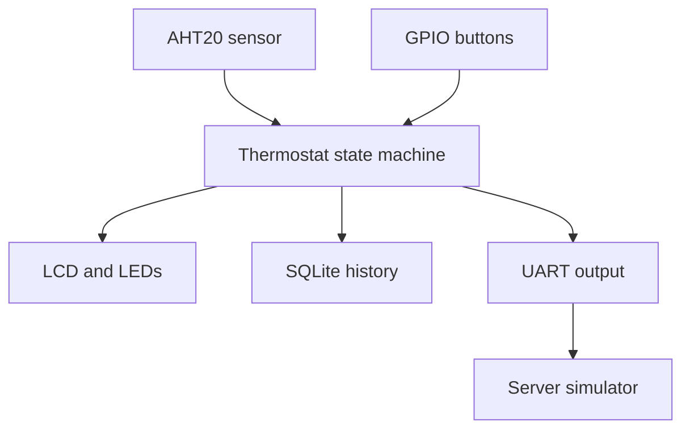

# Raspberry Pi Thermostat System

**Computer Science Capstone ePortfolio | Python, Linux, SQLite, Raspberry Pi**

This repository presents my Southern New Hampshire University computer science capstone. I began with a Raspberry Pi thermostat project and improved it across three areas: software design, control logic, and persistent data storage.

The result is a hardware-integrated Python system that reads temperature data, accepts button input, controls heating and cooling indicators, updates an LCD, sends status data over a serial connection, and stores operating history in SQLite.

## Project at a Glance

| Area | Implementation |
| --- | --- |
| Language | Python |
| Platform | Raspberry Pi running Linux |
| Sensor | AHT20 temperature sensor over I2C |
| User input | GPIO buttons for mode and setpoint control |
| Output | PWM LEDs, 16x2 LCD, and UART serial data |
| Data storage | SQLite temperature and system-state history |
| Design | State machine with off, heat, and cool modes |

## System Capabilities

- Reads live temperature data and converts it to Fahrenheit.
- Cycles between off, heat, and cool operating states.
- Raises or lowers the temperature setpoint through physical buttons.
- Uses red and blue LEDs to show heating and cooling status.
- Alternates temperature and system information on a 16x2 LCD.
- Sends state, temperature, and setpoint data through UART every 30 seconds.
- Stores timestamped readings, operating state, temperature, and setpoint in SQLite.
- Handles sensor, serial, and database errors without immediately terminating the program.

## System Flow

## Capstone Enhancements

### Software Design and Engineering

- Reduced repeated code by introducing focused helper functions.
- Centralized debug logging so diagnostic output can be enabled or disabled.
- Separated display, LED, sensor, serial, and database responsibilities.
- Improved error handling and shutdown cleanup.
- Added clearer comments and method documentation for maintainability.

### Algorithms and Data Structures

- Added a two-degree temperature buffer, or hysteresis range.
- Reduced rapid switching near the selected setpoint.
- Improved the decision logic for active and idle heating or cooling states.

### Database Integration

- Added an SQLite database and a structured `temperature_log` table.
- Stored timestamped temperature, state, and setpoint readings every 30 seconds.
- Created persistent operating history that can support later reporting or analysis.

## Repository Guide

- [`artifacts/enhanced/Thermostat.py`](artifacts/enhanced/Thermostat.py) - enhanced thermostat controller
- [`artifacts/enhanced/ThermostatServer-Simulator.py`](artifacts/enhanced/ThermostatServer-Simulator.py) - serial-data receiver and simulator
- [`artifacts/enhanced/MultiButtonTest.py`](artifacts/enhanced/MultiButtonTest.py) - GPIO button testing utility
- [`artifacts/original`](artifacts/original) - original project version
- [`artifacts/enhanced`](artifacts/enhanced) - capstone-enhanced version

## Hardware and Software Notes

The controller is designed for a Raspberry Pi with the required sensor, display, buttons, LEDs, and serial connection. The source can be reviewed on any platform, but the hardware-dependent features require the connected Raspberry Pi components and their Python libraries.

## Code Review

I recorded a walkthrough of the original system, the identified improvement opportunities, and the planned enhancements:

[Watch the capstone code review](https://youtu.be/J5aNiBfb9lc)

## Skills Demonstrated

Python development, Linux, embedded systems, state-machine design, SQLite, serial communication, modular design, debugging, error handling, technical documentation, and system-level troubleshooting.

## Author

Michael B. Wood  
Bachelor of Science in Computer Science, Software Engineering concentration  
Southern New Hampshire University | Coursework completing August 2026
